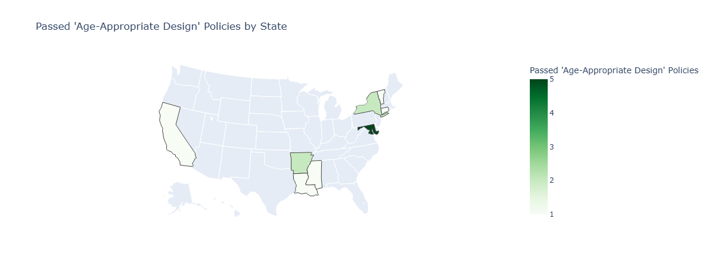
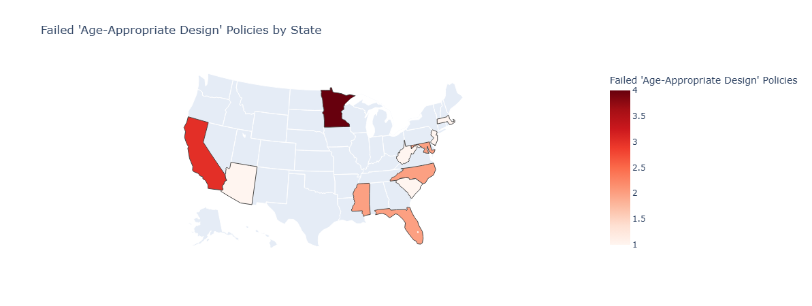

# MIT Policy Hackathon
## Challenge: Internet Policy

Team Members: Carla Sanchez, Kilhah St Fort, Kashish Mistry, Mohani Adem

Leveraging the Integrity Institute's Policy Tracker.

Files:
- `age_appropriate_design.ipynb`: Generation of heatmaps comparing passed and failed regulation related to Age Appropriate Design
- `age_appropriate_design_regulations.csv`: Collection of 37 regulations nationwide that covered the Design and Testing Standards theme and mentioned children/minors/youths or education systems.

### Passed "Age-Appropriate Design" Regulations 

### Failed "Age-Appropriate Design" Regulations

